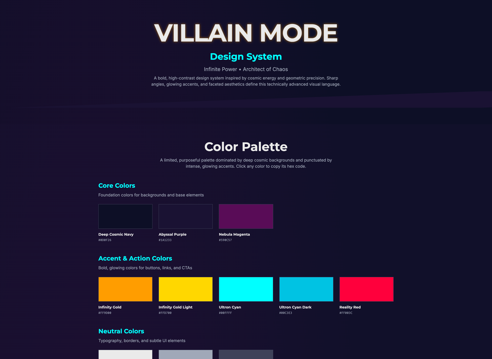

# Villain Mode Design System

A bold, high-contrast design system with an **Electric Geometric** aesthetic. Features vibrant saturated colors, sharp angular geometry, and dramatic lighting effects inspired by low-poly vector art.

**🌐 Live Demo:** [https://villain-mode.web.app](https://villain-mode.web.app)



## 🎨 Design Philosophy

**Theme:** Electric Geometric • Vibrant Low-Poly

- **Bold & High-Contrast:** Deep midnight backgrounds with electric neon accents
- **Geometric & Faceted:** Sharp corners (0px border-radius), angled cuts, skewed elements
- **Split Lighting:** Rim lights and edge glows create dimensional depth
- **Electric Energy:** Hot amber and electric cyan create dynamic contrast

## 🚀 Quick Start

```bash
# Install dependencies
npm install

# Start development server
npm run dev

# Build for production
npm run build

# Preview production build
npm run preview
```

Visit http://localhost:5173/ to view the design system.

## 🎨 Color Palette

### Core Colors (Backgrounds & Base)
- **Midnight Indigo:** `#120E26` - Main background (Tailwind: `midnight-indigo`)
- **Dark Amethyst:** `#2A1B3D` - Cards and surfaces (Tailwind: `amethyst`)
- **Magenta:** `#590C57` - Accents (Tailwind: `magenta`)

### Accent & Action Colors
- **Vibrant Amber:** `#F5A623` - Primary CTAs (Tailwind: `amber`)
- **Pure Gold:** `#FFD700` - Highlights (Tailwind: `gold`)
- **Electric Cyan:** `#00F0FF` - Secondary accents (Tailwind: `cyan`)
- **Cyan Dark:** `#00C3E3` - Borders and links (Tailwind: `cyan-dark`)
- **Red:** `#FF003C` - Alerts (Tailwind: `red`)

### Neutral Colors
- **White:** `#EAEAEA` - Primary text (Tailwind: `white`)
- **Silver:** `#A0A8B8` - Secondary text (Tailwind: `silver`)
- **Grey:** `#3E4259` - Borders and dividers (Tailwind: `grey`)

## 📝 Typography

- **Headings:** Teko (Ultra-condensed, geometric, bold with 1.5px letter-spacing, uppercase)
- **Body:** Inter (Clean, readable, modern)
- **Code:** Fira Code (Monospace with ligature support)

## 🧩 Components

### UI Components (`src/components/ui/`)
- **Button** - Skewed containers with amber-to-gold gradient (primary) and cyan outline (secondary), counter-skewed text
- **Card** - Containers with angled bottom-right corners, cyan rim lighting, and optional gradient hover borders
- **Input** - Form elements with cyan borders and amber focus states
- **Badge** - Small labels with amber/cyan/red variants
- **CodeBlock** - Syntax-highlighted code with custom electric theme

### Showcase Sections (`src/components/showcase/`)
- **Hero** - Opening banner with diagonal section break
- **ColorPalette** - Interactive color swatches (click to copy)
- **TypographyShowcase** - Font families and heading hierarchy
- **ButtonShowcase** - Button variants and states
- **CardShowcase** - Card variations and grid layouts
- **InputShowcase** - Form elements and states
- **CodeBlockShowcase** - Syntax highlighting examples
- **EffectsShowcase** - Visual effects catalog
- **ChartShowcase** - Data visualization with Recharts

## ✨ Key Features

- **Sharp Corners:** All components use 0px border-radius for geometric precision
- **Skewed Buttons:** Transform: `skewX(-15deg)` with counter-skewed text for dynamic visual interest
- **Angled Card Corners:** Clip-path polygon creates signature bottom-right corner cuts
- **Rim Lighting:** Cyan edge glow (box-shadow) creates electric dimensional depth
- **Hot Glow Effects:** Amber hover states with intense outer glow
- **Split Gradient Backgrounds:** Linear gradients replace radial for cleaner aesthetic
- **Semantic Color Names:** Descriptive Tailwind classes (amber, cyan, midnight-indigo) instead of themed names
- **Custom Syntax Theme:** Code blocks styled with electric geometric colors
- **Responsive Design:** Mobile-friendly grid layouts
- **Interactive Elements:** Hover states with 300ms transitions

## 🛠️ Tech Stack

- **Vite** - Lightning-fast build tool
- **React** - Component-based UI library
- **Tailwind CSS** - Utility-first styling with custom configuration
- **Recharts** - Chart library for data visualization
- **Prism React Renderer** - Syntax highlighting for code blocks

## 📁 Project Structure

```
src/
├── components/
│   ├── ui/              # Reusable design system components
│   │   ├── Button.jsx
│   │   ├── Card.jsx
│   │   ├── Input.jsx
│   │   ├── Badge.jsx
│   │   └── CodeBlock.jsx
│   └── showcase/        # Showcase sections
│       ├── Hero.jsx
│       ├── ColorPalette.jsx
│       ├── TypographyShowcase.jsx
│       ├── ButtonShowcase.jsx
│       ├── CardShowcase.jsx
│       ├── InputShowcase.jsx
│       ├── CodeBlockShowcase.jsx
│       ├── EffectsShowcase.jsx
│       └── ChartShowcase.jsx
├── styles/
│   └── index.css        # Global styles and Tailwind imports
├── utils/
│   └── colors.js        # Color palette constants
├── App.jsx              # Main application
└── main.jsx             # Application entry point
```

## 🎯 Design Principles

1. **No Rounded Corners** - All elements use sharp, geometric edges
2. **High Contrast** - Dark backgrounds with bright, glowing accents
3. **Cosmic Energy** - Gradient borders and glow effects
4. **Faceted Aesthetic** - Angular, crystalline visual language
5. **Hard-Edge Lighting** - Solid shadows, no blur
6. **Minimal Animation** - Subtle 300ms transitions only

## 📖 Usage Examples

### Button
```jsx
import Button from './components/ui/Button';

<Button variant="primary" size="medium">
  Unleash Power
</Button>

<Button variant="secondary" size="large">
  Cancel
</Button>
```

### Card
```jsx
import Card from './components/ui/Card';

<Card hover>
  <h3>Interactive Card</h3>
  <p>Hover for gradient border glow</p>
</Card>
```

### Input
```jsx
import Input from './components/ui/Input';

<Input
  placeholder="Enter villain name..."
  value={value}
  onChange={(e) => setValue(e.target.value)}
/>
```

## 📄 License

This is a design system showcase project.

---

**Built with cosmic energy and geometric precision** ⚡
